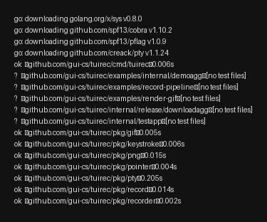

# tuirec

**Cross-platform CLI that records any terminal app and produces animated GIFs or still PNG snapshots.**

Give it a binary and a keystroke script → get a polished GIF or PNG. No manual screen recording, no browser-based tools.



## Install

```sh
# Go (requires Go 1.22+)
go install github.com/gui-cs/tuirec/cmd/tuirec@latest
```

`go install` places the binary in `$(go env GOPATH)/bin/`. Ensure that
directory is on your PATH:

```sh
# Linux / macOS — add to ~/.bashrc, ~/.zshrc, or equivalent:
export PATH="$PATH:$(go env GOPATH)/bin"

# Windows (PowerShell) — add to your user PATH permanently:
$gobin = "$(go env GOPATH)\bin"
[Environment]::SetEnvironmentVariable("Path", "$env:Path;$gobin", "User")
# Then restart your terminal.
```

Verify: `tuirec --version`

Or download a binary from [GitHub Releases](https://github.com/gui-cs/tuirec/releases). Release archives include a pinned `agg v1.8.1` binary next to `tuirec`, and the CLI auto-detects that sibling binary before falling back to `PATH`.
Homebrew and Scoop manifests are planned after the first release automation pass.

**Prerequisite for source builds:** [agg](https://github.com/asciinema/agg) `v1.8.1` renders casts to GIFs. tuirec **auto-downloads `agg`** on first use if it's not found on PATH or in the local cache (`~/.cache/tuirec/agg-v1.8.1/` on Unix, `%LOCALAPPDATA%\tuirec\agg-v1.8.1\` on Windows). You can also pass `--agg-path` explicitly.

## Build and Run Locally on Windows

The CLI shell, cross-platform PTY, asciinema recorder, keystroke player, GIF renderer, recording pipeline, and `record` command are in place.

From the repo root:

```powershell
go build -o .\tuirec.exe .\cmd\tuirec
.\tuirec.exe --version
.\tuirec.exe --help
```

Run the Windows ConPTY tests:

```powershell
go test .\...
```

If `agg` is installed on your PATH or next to `tuirec`, run the GIF renderer and CLI end-to-end integration tests:

```powershell
go test -tags integration .\...
```

To install the pinned `agg` binary locally for demos on Windows:

```powershell
New-Item -ItemType Directory -Force .\tools | Out-Null
Invoke-WebRequest `
  https://github.com/asciinema/agg/releases/download/v1.8.1/agg-x86_64-pc-windows-msvc.exe `
  -OutFile .\tools\agg.exe
.\tools\agg.exe --version
```

On Windows ARM64, upstream `agg v1.8.1` does not publish a native ARM64 Windows binary. The Windows ARM64 tuirec release archive includes the x64 Windows `agg` binary for Windows x64 emulation (validated on Windows ARM64). You can also build `agg` from source and pass that binary with `--agg-path`. The demo commands automatically prefer `.\tools\agg.exe` when it exists.

To create and open a visible demo GIF from the bundled cast fixture:

```powershell
go run .\examples\render-gif -output .\demo.gif
Invoke-Item .\demo.gif
```

To exercise the full package pipeline against the bundled test TUI and open the result:

```powershell
go run .\examples\record-pipeline -output .\pipeline-demo.gif -cast-output .\pipeline-demo.cast
Invoke-Item .\pipeline-demo.gif
```

To run the real CLI against the bundled test TUI and open the result:

```powershell
go run .\cmd\tuirec record `
  --binary go `
  --args run,.\internal\testapp `
  --keystrokes "wait:1000,ArrowRight,ArrowDown,`Hi`,wait:500,Ctrl+Q" `
  --output .\cli-demo.gif `
  --cast-output .\cli-demo.cast
Invoke-Item .\cli-demo.gif
```

## Usage

```sh
tuirec record \
  --binary ./myapp \
  --name "demo" \
  --show-command '$ myapp foo.cs' \
  --keystrokes "wait:2000,Tab,Enter,wait:1000,`search term`,wait:500,Ctrl+C" \
  --kitty-keyboard \
  --drain 2000 \
  --open --copy
```

`--name` sets output to `artifacts/<name>.gif` and `artifacts/<name>.cast`
automatically. `--open` launches the GIF in the default viewer; `--copy` puts
the GIF path on the clipboard.

Use `--show-command` to add a synthetic shell prompt/command pre-roll to the
GIF before the target app starts. `--trim` (enabled by default) rebases
timestamps to the first visible output and removes post-alt-screen-exit noise
while preserving setup sequences. `--startup-delay` waits after the target
starts before copying its output and playing input. `--drain` keeps recording
after the last keystroke so the final UI state is visible. For troubleshooting,
`--verbosity high` logs the command pre-roll, key tokens, and pacing to stderr.

### Keyboard and Mouse Syntax

Tokens are comma-separated. Each token is one of:

| Token | Example | Description |
|---|---|---|
| Named key | `Enter`, `Esc`, `Tab`, `Delete` | Special key press |
| Navigation | `CursorUp`, `PageDown`, `Home`, `End` | Arrow/nav keys |
| Modifier combo | `Ctrl+C`, `Alt+A`, `Shift+Tab` | Modifier + key |
| Wait | `wait:2000` | Pause N milliseconds |
| Literal text | `` `hello world` `` | Backtick-quoted, typed char-by-char |
| Mouse click | `click:10:5` | SGR left click at col:row (1-based) |
| Right click | `rightclick:10:5` | SGR right click at col:row |
| Middle click | `middleclick:10:5` | SGR middle click at col:row |
| Double click | `doubleclick:10:5` | Two rapid left clicks at col:row |
| Scroll | `scroll:up:10:5`, `scroll:down:10:5` | Scroll wheel at col:row |
| Drag | `drag:1:1:40:20` | Drag from col1:row1 to col2:row2 |
| Mouse move | `move:10:5`, `hover:10:5` | Motion event at col:row (for hover effects) |

Key names use Terminal.Gui's `Key.ToString()` / `Key.TryParse()` format.
Multi-character literal text **must** be backtick-quoted. Single characters
work without quoting. Unknown bare tokens produce a clear error with guidance.

### Mouse Pointer Indicator

Show a visible pointer at mouse event positions in recorded GIFs:

```sh
tuirec record --mouse-pointer all --binary ./myapp --keystrokes "..."
```

- `--mouse-pointer all` — show pointer on all mouse events (clicks + moves + drags)
- `--mouse-pointer clicks` — (default) only clicks, drags, scrolls
- `--mouse-pointer none` — disable pointer indicator
- `--pointer-style "►"` — use a different character (default `●`)


## For AI Agents

tuirec provides three layers of agent guidance — enabling agents to one-shot
the creation of GIFs of TUI apps doing complicated stuff:

| Layer | Purpose | Access |
|-------|---------|--------|
| **OpenCLI** | Discovery — enumerate commands and flags | `tuirec opencli` |
| **Agent guide** | Semantics — keystroke syntax, timing budgets, platform gotchas, quoting rules | `tuirec agent-guide` |
| **Recipe files** | Task-specific runbooks an agent can follow verbatim | [`scripts/HERO-GIF.md`](scripts/HERO-GIF.md) |

OpenCLI tells an agent *what flags exist*. The agent guide teaches *how to use
them correctly*. Recipe files say *"just do this"* for a specific recording.

```sh
tuirec agent-guide   # full keystroke reference + best practices
tuirec opencli       # machine-readable command schema (OpenCLI draft spec)
```

If tuirec is not installed, download it from
[GitHub Releases](https://github.com/gui-cs/tuirec/releases) — archives
include both `tuirec` and `agg`. See [`llms.txt`](llms.txt) for a
machine-readable project summary.
