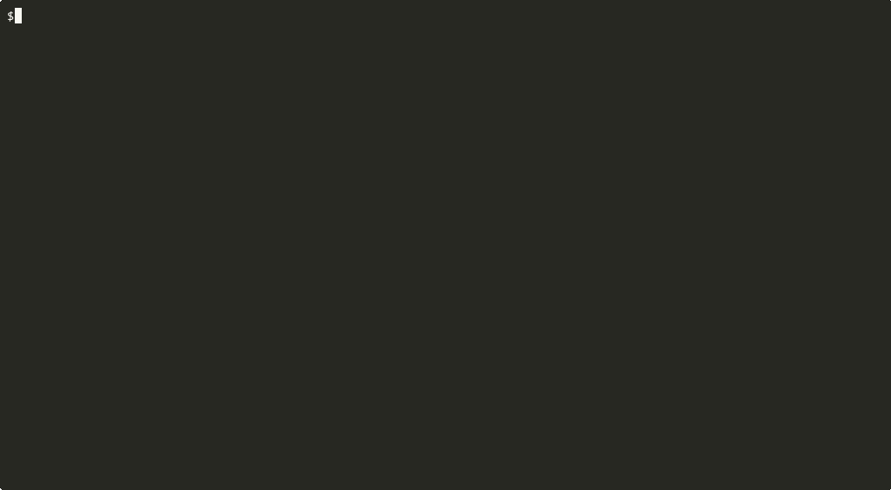

# tuirec

**Cross-platform CLI that records any terminal app and produces an animated GIF.**

Give it a binary and a keystroke script → get a polished GIF. No manual screen recording, no browser-based tools.



## Install

```sh
# Go (requires Go 1.22+)
go install github.com/gui-cs/tuirec/cmd/tuirec@latest
```

`go install` places the binary in `$(go env GOPATH)/bin/`. Ensure that
directory is on your PATH:

```sh
# Linux / macOS — add to ~/.bashrc, ~/.zshrc, or equivalent:
export PATH="$PATH:$(go env GOPATH)/bin"

# Windows (PowerShell) — add to your user PATH permanently:
$gobin = "$(go env GOPATH)\bin"
[Environment]::SetEnvironmentVariable("Path", "$env:Path;$gobin", "User")
# Then restart your terminal.
```

Verify: `tuirec --version`

Or download a binary from [GitHub Releases](https://github.com/gui-cs/tuirec/releases). Release archives include a pinned `agg v1.5.0` binary next to `tuirec`, and the CLI auto-detects that sibling binary before falling back to `PATH`.
Homebrew and Scoop manifests are planned after the first release automation pass.

**Prerequisite for source builds:** [agg](https://github.com/asciinema/agg) `v1.5.0` renders casts to GIFs. tuirec **auto-downloads `agg`** on first use if it's not found on PATH or in the local cache (`~/.cache/tuirec/agg-v1.5.0/` on Unix, `%LOCALAPPDATA%\tuirec\agg-v1.5.0\` on Windows). You can also pass `--agg-path` explicitly.

## Build and Run Locally on Windows

The CLI shell, cross-platform PTY, asciinema recorder, keystroke player, GIF renderer, recording pipeline, and `record` command are in place.

From the repo root:

```powershell
go build -o .\tuirec.exe .\cmd\tuirec
.\tuirec.exe --version
.\tuirec.exe --help
```

Run the Windows ConPTY tests:

```powershell
go test .\...
```

If `agg` is installed on your PATH or next to `tuirec`, run the GIF renderer and CLI end-to-end integration tests:

```powershell
go test -tags integration .\...
```

To install the pinned `agg` binary locally for demos on Windows:

```powershell
New-Item -ItemType Directory -Force .\tools | Out-Null
Invoke-WebRequest `
  https://github.com/asciinema/agg/releases/download/v1.5.0/agg-x86_64-pc-windows-msvc.exe `
  -OutFile .\tools\agg.exe
.\tools\agg.exe --version
```

On Windows ARM64, upstream `agg v1.5.0` does not publish a native ARM64 Windows binary. The Windows ARM64 tuirec release archive includes the x64 Windows `agg` binary for Windows x64 emulation (validated on Windows ARM64). You can also build `agg` from source and pass that binary with `--agg-path`. The demo commands automatically prefer `.\tools\agg.exe` when it exists.

To create and open a visible demo GIF from the bundled cast fixture:

```powershell
go run .\examples\render-gif -output .\demo.gif
Invoke-Item .\demo.gif
```

To exercise the full package pipeline against the bundled test TUI and open the result:

```powershell
go run .\examples\record-pipeline -output .\pipeline-demo.gif -cast-output .\pipeline-demo.cast
Invoke-Item .\pipeline-demo.gif
```

To run the real CLI against the bundled test TUI and open the result:

```powershell
go run .\cmd\tuirec record `
  --binary go `
  --args run,.\internal\testapp `
  --keystrokes "wait:1000,ArrowRight,ArrowDown,`Hi`,wait:500,Ctrl+Q" `
  --output .\cli-demo.gif `
  --cast-output .\cli-demo.cast
Invoke-Item .\cli-demo.gif
```

## Usage

```sh
tuirec record \
  --binary ./myapp \
  --name "demo" \
  --show-command '$ myapp foo.cs' \
  --keystrokes "wait:2000,Tab,Enter,wait:1000,`search term`,wait:500,Ctrl+C" \
  --kitty-keyboard \
  --drain 2000 \
  --open --copy
```

`--name` sets output to `artifacts/<name>.gif` and `artifacts/<name>.cast`
automatically. `--open` launches the GIF in the default viewer; `--copy` puts
the GIF path on the clipboard.

Use `--show-command` to add a synthetic shell prompt/command pre-roll to the
GIF before the target app starts. `--startup-delay` waits after the target
starts before copying its output and playing input. `--drain` keeps recording
after the last keystroke so the final UI state is visible. For troubleshooting,
`--verbosity high` logs the command pre-roll, key tokens, and pacing to stderr.

### Keystroke syntax

Tokens are comma-separated. Each token is one of:

| Token | Example | Description |
|---|---|---|
| Named key | `Enter`, `Esc`, `Tab`, `Delete` | Special key press |
| Navigation | `CursorUp`, `PageDown`, `Home`, `End` | Arrow/nav keys |
| Modifier combo | `Ctrl+C`, `Alt+A`, `Shift+Tab` | Modifier + key |
| Wait | `wait:2000` | Pause N milliseconds |
| Literal text | `` `hello world` `` | Backtick-quoted, typed char-by-char |
| Mouse click | `click:10:5` | SGR click at col:row |

Key names use Terminal.Gui's `Key.ToString()` / `Key.TryParse()` format.
Multi-character literal text **must** be backtick-quoted. Single characters
work without quoting. Unknown bare tokens produce a clear error with guidance.

## For AI Agents

tuirec is designed to be driven by AI coding agents. Run:

```sh
tuirec agent-guide
```

This prints the full keystroke syntax reference, best practices, and examples.
AI agents can use this output to compose keystroke scripts and invoke recordings
without any prior knowledge of the tool.

If tuirec is not installed, download it from
[GitHub Releases](https://github.com/gui-cs/tuirec/releases) — archives
include both `tuirec` and `agg`. See [`llms.txt`](llms.txt) for a
machine-readable project summary.
